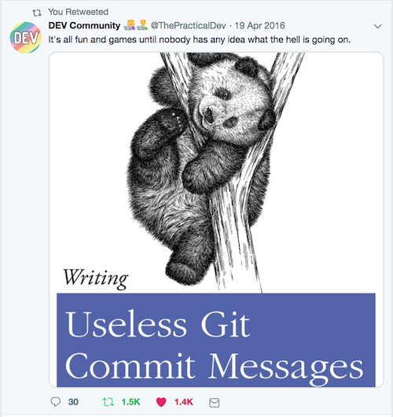

# Workflow 1a:  Create and update my repo

#### In this workflow, you will learn how to:
- [ ] Create a repo on GitHub (GH)
- [ ] Clone a repo
- [ ] Look at remotes
- [ ] Update a local repo from the remote (pull)
- [ ] Update a remote from local changes (push)
- [ ] Look at Git history

---

## Step 0:  Recap: Configure local Git user
**REMINDER:**  Did you [configure the Git user name on your machine?](https://github.com/reshamas/git-intro-workshop/blob/master/workflows/w_0_3_setup.md#step-1--configure-user-on-local-computer)

## Step 1:  Create a repository (on GitHub)

- Click on `+` next to your profile picture
- Select `New repository`
- Repository name:  `git_workshop`
- Description (optional):  `My repo for the git workshop!`
- Select `Public` for the repo setting
- Check box for `Initialize this repository with a README`
- Click green button `Create repository`

## Step 2:  Let's play around on GitHub

Usually, we'd be creating and modifying files (e.g. code) on our own machines and then pushing them to GitHub. However, for the purpose of this workshop, we'll start with creating some files directly on GitHub!

- On your repo homepage (Under `<> Code`), click the `Add file` button
- Select ` Create new file'
- Add a Markdown file: `mymarkdown.md`
  - Add some text
  - Commit file at end of page
  - Add a useful description as commit message
- Add a Python file: `hello.py`
  - Add a line, the ubiquitous: `print("Hello World")`
  - Commit file at end of page
  - Add a useful description as commit message
  
**The usual workflow is to create a repo, clone it, create and edit all your files locally, and then push things to your repo. We're just creating files on GitHub for a quick start!**

### Note: Ensure commit messages are meaningful.

Commit messages are an easy way for yourself and other people to know what each change (commit) includes. Make them meaningful and describe what you did, rather than just "fix" or "tweak" or "foo".




## Step 3: `clone` the repo from GitHub to our local machine

**Q:  What is cloning?**  
**A:  Making a copy of something.**

For Git, it generally means making a *local copy* of a repository that's hosted somewhere else.

**Copy URL for cloning:**
Click on the green button on the home page of your "git_workshop" repo on GitHub. It will show two URL options:
- If you have not yet set up your SSH keys, you will authenticate with username and password - pick the HTTPS URL to clone the repo
- If you have already set up your SSH keys, pick the SSH option
- Copy the URL!


## Step 4:  Clone the repository to your local machine  
Open your terminal, go to your working directory, and clone your repo. **Make sure to use your own URL!!**

```bash
cd /Users/sam/code/
git clone https://github.com/spbail/git_workshop.git
```

## Step 6:  Inspect the repo

Navigate to the repo you just cloned and look at the files and directories it contains:

```bash
cd git_workshop 
ls -lah
```

**Running git status**:
`git status` always shows you the current status of your repository. It shows what branch you are on and what the status of the files in your repository is. Go ahead 
	
**Quick detour: let's look at the contents of the (hidden) .git directory in your repo!**

## Step 7:  Look at remotes
**Q:  What is a remote?**  
**A:  **Remotes** are copies of a repo on another computer **(or on a service like GitHub)****

This is what `git remote` looks like if you have cloned your repo with HTTPS:

```bash
git remote -v
origin	https://github.com/spbail/git_workshop.git (fetch)
origin	https://github.com/spbail/git_workshop.git (push)
```
The URL will look different if you have cloned it with SSH.

**Notes**
1. Each remote has a name (e.g. `origin`) and a URL. Remotes can have any name you want, but `origin` is the default for the default remote when you first clone your repo.
2. Notice you have push and pull access to the remote.  
3. To remove a remote:  `git remote rm <remote_name>`

## Step 8:  Update a local repo from a remote (pull)

This step syncs changes from a *remote* repository to a *local* repository. This is usually important when you're collaborating with someone else and they might have made changes to files in the repo.

You usually do this **before starting work in a repository so you have the most up-to-date-changes.**   

**Note:**  This is a good step to practice even though the first time you clone a repo it will already be up to date.   

Let's do a small exercise to pretend someone has made changes to the repo content:
* Run `git pull` in your local repo.
* On GitHub, create a new file called `name.py` and add a `print('Hello!')`
* In your local repo, run `git pull` to sync the new file to your machine.


## Step 9:  Update a remote repo with local changes (push)
This step syncs a remote repository with a local repository. We usually **don't make changes on the main branch. We'll cover branches in the next section!**   

**Create a new file and verify it's there: **
```bash
touch another_file.md
ls -lah
```

---
# :arrow_right_hook: Standard Git workflow

## Git flow in your terminal
| #     | Command                   | Step  | Description      |
|-------|---------------------------| -----|------------------|
|  1    | `git add <filename>`      | Begin tracking a file | Adds a change in the working directory to the staging area; tells Git that you want to include updates to a particular file in the next commit.  |    
|  2    | `git commit -m "message"` | Log the change | Changes are recorded in Git (interaction is with local repo) |  
|  3    | `git push`                | Finalize the change | Changes are pushed from Git (local, terminal) to GitHub (browser, remote) | 
 
**Note:**  It is better to make many commits with smaller changes rather than of one commit with massive changes: small commits are easier to read and review. **However** you might want to "squash" all your commits in the end to make sure the Git history isn't cluttered.


## Step 11:  Get status of repo
`git status`
>my example
```bash
% git status
On branch master
Untracked files:
  (use "git add <file>..." to include in what will be committed)
	another_file.md
nothing added to commit but untracked files present (use "git add" to track)
```
    
## Step 12:  Add/stage a file
<kbd> git add <file_name> </kbd>   
	
>my example  
```bash
git add another_file.md 
```

**Note:**  to `add` a file is to begin tracking it:  
- Adds a change in the working directory to the staging area
- Tells Git that you want to include updates to a particular file in the next commit

## Step 13:  Get status of repo
<kbd> git status </kbd>  
>my example
```bash
% git status
On branch sam_wip
Changes to be committed:
  (use "git reset HEAD <file>..." to unstage)

	new file:   another_file.md
```

## Step 14:  commit a file  
<kbd> git commit -m 'message' </kbd>  
	
>my example
```bash
git commit -m 'Adding a new file'
```
	
```bash
% git commit -m 'Adding a new file'
[master 3950dd9] Adding a new file
 1 file changed, 0 insertions(+), 0 deletions(-)
 create mode 100644 another_file.md
```
**Note:**  to `commit` a file is to "log the change":  
- Changes are recorded in Git (interaction is with local repo)

## Step 15:  Get status of repo
<kbd> git status </kbd>  
>my example
```bash
% git status
On branch master
Changes to be committed:
  (use "git reset HEAD <file>..." to unstage)

	new file:   another_file.md
```

## Step 19:  push changes to your remote repo
<kbd> git push </kbd>  
	
>my example
```bash
git push
```	

```bash
Counting objects: 3, done.
Delta compression using up to 4 threads.
Compressing objects: 100% (2/2), done.
Writing objects: 100% (3/3), 273 bytes | 0 bytes/s, done.
Total 3 (delta 0), reused 0 (delta 0)
To https://github.com/spbail/git_workshop.git
 * [new branch]      master -> master
 ```
**Note:**  to `push` a "commit" is to "finalize the change":  
- changes are pushed from Git (local) to GitHub (browser account, remote)

## Final step
Look at new file on GitHub!

---

# Git history

(Not that kind of history)

## What is a commit?
A commit is a snapshot of your files at a point in time that's associated with an author and a list of changes. You can see the list of all commits in your repository via the git log:
<kbd>git log</kbd>

>my example
```bash
git log
```

```bash
commit 13afc8e450045f80cf00633a438547091bcac4c1
Author: Sam Bail <samanthapbail@gmail.com>
Date:   Tue Aug 6 15:50:21 2019 -0400

    Create hello.py
```

Each commit has a **commit hash** (you'll see either the long or short version) that is used to identify that particular commit.

## git blame and git show

Sometimes you want to know who made changes to a particular line in a file. You can use `git blame <filename>` to see each line annotated with the commit hash and author:

```bash
git blame holiday.md 
```
```bash
fb319636 (Sam Bail 2019-08-06 15:50:02 -0400 1) Looking forward to the party :pizza: ! :smiley:
```

By using `git show <commit hash>` you can see all the changes associated with a specific commit:

```bash
git show fb319636
```
```bash
commit fb319636d437015d7893663df58fdef840b04b41
Author: Sam Bail <samanthapbail@gmail.com>
Date:   Tue Aug 6 15:50:02 2019 -0400

    Create holiday.md

diff --git a/holiday.md b/holiday.md
new file mode 100644
index 0000000..62404c4
--- /dev/null
+++ b/holiday.md
@@ -0,0 +1 @@
+Looking forward to the party :pizza: ! :smiley:
```
