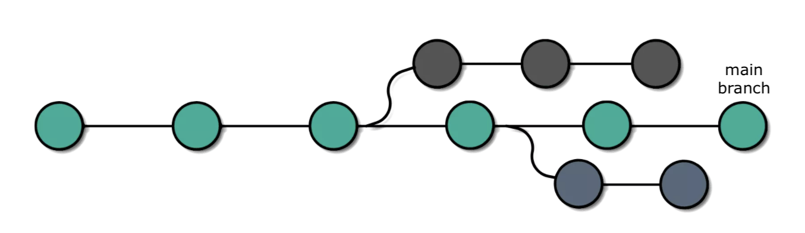
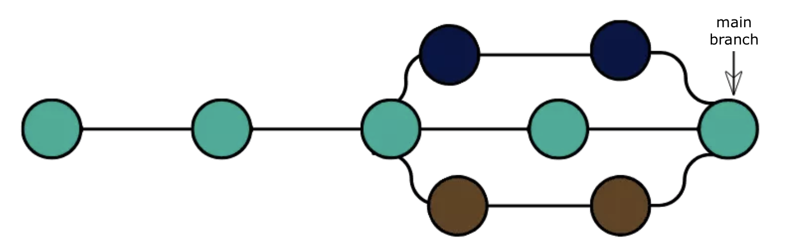
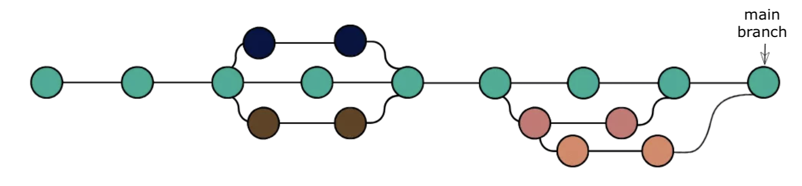

# Workflow 1.3: Branches in git

### In this workflow, you will learn how to:

1. List branches in your local repo
2. Create a new working branch in your local repo
3. Switch to a new working branch
4. Make changes on your working branch and commit them
5. Push changes to a branch on GitHub
6. Submit a pull request (PR) on GitHub
7. Sync merged changes to your main branch

## Why use branches?

- **Branching** means you diverge from the main line (usually the "main" branch) of development and continue to do work without modifying the main line, like "scratch paper" but for code.
- We generally start all new changes on a new branch, especially when working in a shared repo.
- This minimizes disruption to the main branch, which should always be the most recent working version of our code. Branches allow us to experiment and break things.
- This is an interesting article on branches: [Atlassian tutorial on branches](https://www.atlassian.com/git/tutorials/using-branches)


## Step 1:  List branches in your local repository

```bash
git branch
```
 
## Step 2:  Create a new working branch (or "feature branch")

```bash
git branch example_branch
```

You can verify that the branch was created:

```bash
git branch
```

**Notes:** 
- You can create a branch off of any branch, not just main. When creating a new branch, make sure you're branching off of the right thing!
-When working in shared repos, it's also good practice to go to main (or the feature branch you want to work off) and pull from the remote before branching. That way you're branching off of the latest status of the repo.
- Branch naming is totally up to you. For shared repos, I usually prefix with my name, e.g. `git branch sam/example_branch`.


## Step 3:  Switch to working branch

Once you've created your new branch, you need to switch to it in order to make all changes on that new branch:
  
```bash
git checkout example_branch
```

You can then verify that you're on the new branch:
```bash
git status
```

### Alternative (one-line) workflow for the above steps:

I often run the creation and switching in one step:

```bash
git checkout -b <branch_name> 
```

## Step 4: Modify a file on your branch

Open the existing file `another_file.md` in a text editor and change the text a little. Then check the status of the repo to see that the file has been changed:

```bash
git status
```

## Step 5: Go through the git add/commit workflow

Use git add and commit to make a new "commit" for modified file and verify the commit is in the log:

```bash
git add another_file.md
git commit -m "Made some changes to the text."
git log
```

## Step 6:  Push changes to your working branch

When pushing from the `main` branch, Git already knows what remote and branch to use. However, for new branches, you will need to specify the remote and branch when pushing:

```bash
git push origin example_branch
```

## Step 7: Look at files on working branch on GitHub

- Go to your repo on GitHub
- Toggle "Branch" dropdown to find our working branch
- Click the file and confirm that your changes are there
	
## Step 8: Creating a pull request (on GitHub)

A "pull request" (PR) is a way to compare the new code on your branch to another branch, usually "main". That way, other collaborators can review your code and approve it to be **merged** into main, or request changes.

- There are several ways to open a pull request. You can use any of the following:
  1. For a recently created branch, your repo homepage will have a green button at the top *"Compare and pull request"*.
    2. The "branches" page also has a *"New pull request"* button for each branch.
- At the top of the PR page, you'll see what repo and branch you're comparing to.
- Make sure the title and comment are useful for whoever will be reviewing the PR.
- Then click the green button to create your PR.
- The PR will show up under the "Pull requests" tab in your repo. You can accept your own PR for now and click "Merge pull request"

## Step 9: Sync the local main branch

Remember that after merging the changes to main on GitHub, they are still only on your **local working branch** and on the **main branch on GitHub**. Merging the PR in GitHub means your local main branch is now a commit behind. 

You can simply switch to the local `main branch`, pull to sync the changes from the remote and confirm that the most recent commit is now there:

```bash
git checkout main
git pull
git log
```
That way your local main branch is up to date again.


## Some more info on branches (if we have time)

This is what we do when we create a feature branch off of the `main` branch:


This is what it looks like when feature branches are merged back into the `main` branch:



You can also branch off of a branch that's not `main`. We often use this pattern if we have a longer running "feature branch" and want to make small changes against that branch rather than `main`:



**Make sure you run `git status` to check what branch you're on before creating a new branch off it!**
